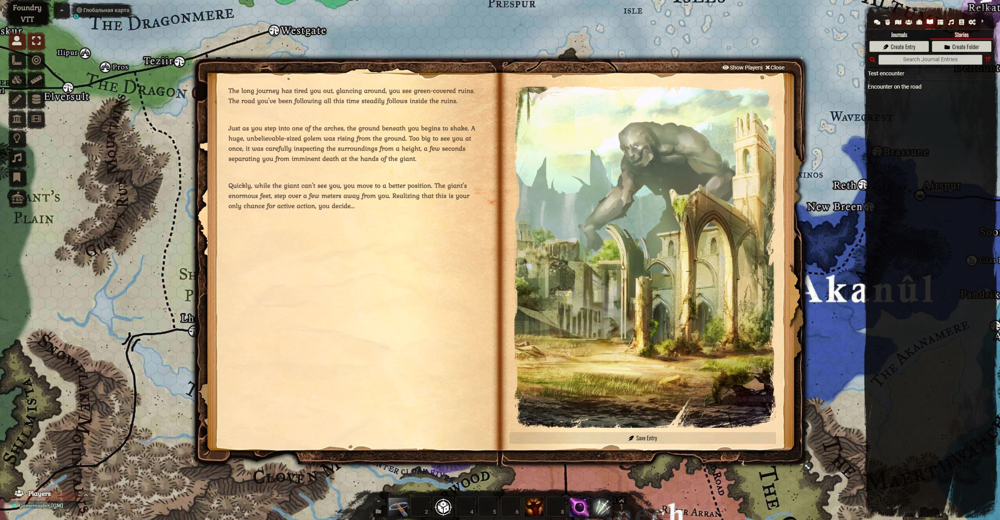
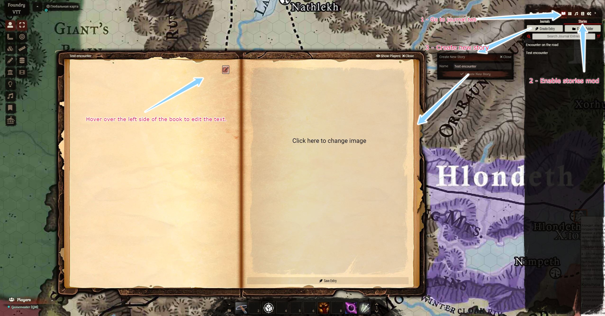
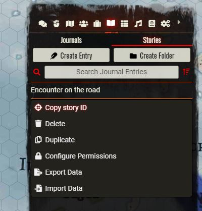
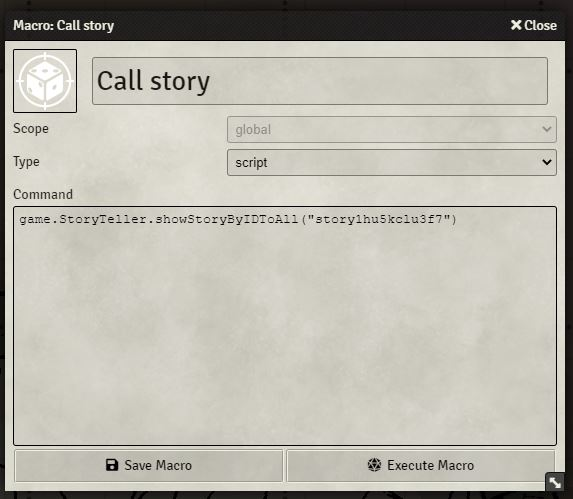

# Storyteller for Foundry VTT
A small modification that allows you to present the story in the game as an open book. Inspired by the storyteller from Pathfinder: Kingmaker


The modification allows you to use pre-prepared event descriptions, playing them out when your group gets into trouble.
When you press the "Show players" key, the story is shown to all active players.
A set of multiple stories, allowing you to change them one by one, reacting to the players actions.
 
Use macros to integrate with mods like:
- [Trigger Happy](https://github.com/League-of-Foundry-Developers/fvtt-module-trigger-happy)
- [Hey, Wait!](https://foundryvtt.com/packages/hey-wait/)

For best effect.

## How it looks



## Creating a new story



## Using with macros

### Step 1. Copy story ID from context menu

### Step 2. Create new macro, use the copied ID
```javascript
game.StoryTeller.showStoryByIDToAll("story1hu5kclu3f7")
```

### Step 3. Use the calling of this macro to show your story to all the players at once.